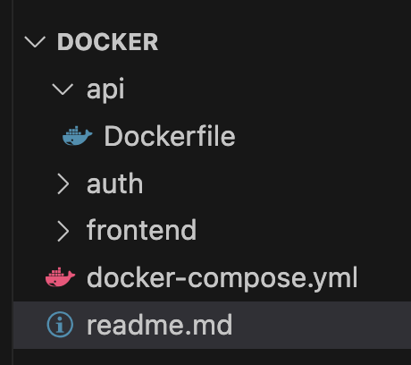

# Docker and Docker Compose

## Initial settings

Folder strucure


docker-compose.yml
```yml
services:
  api:
    build: ./api
```
```yml
FROM node:13
```

### inital build
Terminal
```bash
% docker-compose build
[+] Building 0.9s (6/6) FINISHED                                                         docker:desktop-linux
 => [api internal] load build definition from Dockerfile                                                 0.0s
 => => transferring dockerfile: 49B                                                                      0.0s
 => [api internal] load metadata for docker.io/library/node:13                                           0.9s
 => [api internal] load .dockerignore                                                                    0.0s
 => => transferring context: 2B                                                                          0.0s
 => CACHED [api 1/1] FROM docker.io/library/node:13@sha256:70d4fffcab39a1f9f7161d58e674ddcc56c7f0724196  0.0s
 => [api] exporting to image                                                                             0.0s
 => => exporting layers                                                                                  0.0s
 => => writing image sha256:a7ec714cc2ef7486cbbf912e534d0116548f13ca7b4aed382b84c267cbaddd87             0.0s
 => => naming to docker.io/library/docker-api                                                            0.0s
 => [api] resolving provenance for metadata file  
```

### make package.json and install express
`cd` to `api` and setup node env by `npm init -y` and install express by `npm install express`

### make .gitignore file in api dir
.gitignore
```js
node_modules
```

### basic express setting in index.js
```js
const express = require('express');

const app = express();

app.get('/test', (req, res) => {
  res.send('API server is OK');
});

app.listen(3000, () => {
  console.log("started API service");
});
```

### add `start` with `node src/index.js` to test API server

### `npm start` and check it  in browser with `localhost:3000/test`

### prepare docker image
```bash
jae@Jaeui-Macmini api  % docker images
REPOSITORY        TAG         IMAGE ID       CREATED       SIZE
jenkins/jenkins   lts-jdk17   0c07640a5e42   2 weeks ago   498MB
docker-api        latest      a7ec714cc2ef   4 years ago   891MB
```
make .dockerignore file on API root dir and add node_modules, Docker not to copy

Dockerfile
```js
FROM node:13

WORKDIR /usr/src/app

COPY package*.json ./

RUN npm install

COPY . .
```

### Run `docker-compose build`

### Run `docker images` and check `docker-api` <rootDir-currentDir>

### add command and port in docker-compose
```yml
version: 3  # docker version number

services:
  api:
    build: ./api
    command: npm run start
    restart: unless-stopped # it starts automatically when it is stopped unless admin explicitly stop it
    ports: 
      - "3000:3000" #port number to access from outside : port number of container, app.listen(3000, fn) in index file
    environment:
      - PORT=3000  # this will be process.env.PORT  
      - HOST=http://myworld-docker.com   # this will be process.env.HOST  
```

### run `docker-compose build` to build image
### run `docker-compose up` to run server
## or
### run `docker-compose up --build` to build and run server

### alphine version is much more smaller, search in docker hub


## Add Database
```zsh
% npm install mongoose
```


## Volume
Whenever we make images, data in database is lost. So we need persistence. The storage won't be inside image or container. 

```yml
  api_db:               # go to docker hub and search mongo
    image: mongo:latest # No need to build, just use image coz we gonna use it as is
    volumes:
      - mongodb_api:/data/db    # in case we allocate volume in api_db

volumes:    # when volume is used globally
  mongodb_api:
```


### in dev env, we may need to mount volumes in our src folder
#### in this case, make `docker-compose.development.yml` and 
```yml
version: '3'

services:
  api:
    command: npm run dev
    volumes:
      - ./api/src:/usr/src/app/src  # mount volume in our src folder
```
build with docker-compose.yml but overwrite with docker-compose.development.yml
```zsh
% docker-compose -f docker-compose.yml -f docker-compose.development.yml build 
% docker-compose -f docker-compose.yml -f docker-compose.development.yml up      
```

#### install `nodemon` and make nodemon.json file under api dir
```json
{
  "verbose": false,
  "watch": ["src"],
  "exec": "node src/index.js"
}
```
#### in package.json
```json
  "scripts": {
    "start": "node src/index.js",
    "dev": "nodemon"
  },
```

### Naming containers with namespace in docker-compose so that we distingsh container names easier
```yml
container_name: myworld-docker-api
container_name: myworld-docker-auth
container_name: myworld-docker-api-db 
container_name: myworld-docker-auth-db
```

## Setup relevant folders and files and add auth service in docker-compose 
```shell
% docker-compose up --build
```

## setup frontend
```shell
% rm -rf frontend   #delete frontend folder first
% npm init react-app frontend
```
### fill up correspoding settings in docker-compose.yml
#### setup port 3000 for frontend, 3001 for api and 3002 for auth 

### To serve from static server
```shell
% npm install -g serve
% serve -s build
% serve -s build -l 3001  #change port
```

### interactive stdin substitute
in Dockerfile
``` dockerfile
RUN npm run build

RUN npm -g serve
```
in docker-compose
``` yaml
command: npm run start # delete

command: serve -s build -l 3000

# comment out from stdin to volume
```

### Cut the comment part and paste to docker-compose.dev yaml
```yaml
  frontend:
    command: npm run start
    stdin_open: true    # interactive 
    tty: true
    volumes:
      - ./frontend/src:/usr/src/app/src  # mount volume in our src folder

``` 

## setup nginx
```yaml
  nginx:
    image: nginx:stable-alpine
    container_name: myworld-docker-nginx  
    ports: 
      - "80:80"
    volumes:
      - ./nginx/nginx.conf.prod:/etc/nginx/conf.d/nginx.conf  
    depends_on: 
      - frontend
```
```shell
% ps aux | grep nginx # search port 80 is using
```

Then configure nginx folder
- nginx.conf.prod file
```nginx
server {
  listen 80;

  server_name myworld-docker.com;

  location / {
    proxy_pass http://frontend:3000;
  }
}
```
### use public domain 
#### configure domanin name in /etc/hosts 
```shell
sudo nano /etc/hosts

```

- add domain name then it will be trying to resolve in the lcoal machine
```conf
127.0.0.1 myworld-docker.com        

```

```shell
% docker-compose up --build

% docker logs myapp-docker-nginx
```

#### comment out frontend ports
```yaml
  frontend:
    build: ./frontend
    container_name: myworld-docker-frontend
    restart: unless-stopped
 #   ports:
 #     - "3000:3000"
    command: serve -s build -l 3000
```

## make API as public

### setup currentUser route in Auth api
- auth/src/index.js 
```js
app.get("/currentUser", (req, res) => {
  res.json({
    id: "1234",
    email: "foo@gmail.com"
  });
});
```
-api/configutaion/index.js
```js
module.exports.authApiUrl = process.env.AUTH_API_URL;
```

-api section in docker-compose
```yaml
    environment:
      - PORT=3001    
      - HOST=http://myworld-docker.com   
      - MONGO_URL=mongodb://api_db:27017/api
      - AUTH_API_URL=http://auth:3002/api # add this line

  auth:
    build: ./auth
    container_name: myworld-docker-auth
    command: npm run start
    restart: unless-stopped
    # ports:
    #   - "3002:3002"       # comment out
```

- For test, add console in api/src/index
```js
const startServer = () => {
  app.listen(port, () => {
    console.log(`started API service on port ${port}`);
    console.log(`Our host is ${host}`);
    console.log(`DB url is ${db}`);
    console.log(`auth url is ${authApiUrl}`); // add this line
  });
};
```

### install axios in `api folder`
```shell
% npm install axios
```

### test auth
- index.js in api
```js
app.get('/testwithcurrentuser', (req, res) => {
  axios.get(authApiUrl + '/currentuser').then(respone => {
    res.json({
      testwithcurrentuser: true,
      currentUserFromAuth: response.data
    });
  });
});

```


## Other docker command
```zsh
% docker ps    # docker process
% docker volumne ls #list
% docker volumne rm myvolume  #delete

```
```zsh
% docker exec -it myworld-docker-frontend sh # jump into container shell

``` 